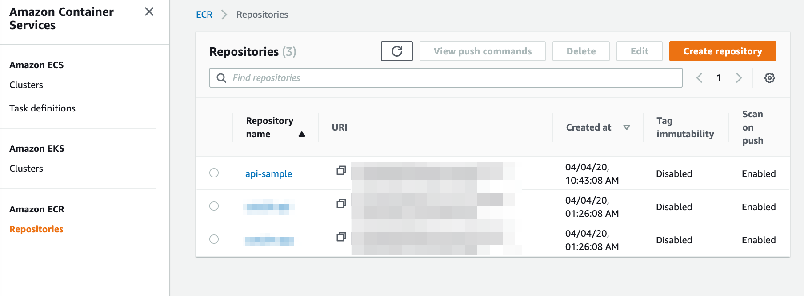

# 🚀 Docker ECR for GitHub Actions

[GitHub Action](https://developer.github.com/actions/) for uploading Docker Image to Amazon Elastic Container Registry (ECR).

[](https://github.com/appleboy/discord-action/actions)



## What is ECR

Amazon Elastic Container Registry (ECR) is a fully-managed Docker container registry that makes it easy for developers to store, manage, and deploy Docker container images. Amazon ECR is integrated with Amazon Elastic Container Service (ECS), simplifying your development to production workflow. Amazon ECR eliminates the need to operate your own container repositories or worry about scaling the underlying infrastructure. Amazon ECR hosts your images in a highly available and scalable architecture, allowing you to reliably deploy containers for your applications. Integration with AWS Identity and Access Management (IAM) provides resource-level control of each repository. With Amazon ECR, there are no upfront fees or commitments. You pay only for the amount of data you store in your repositories and data transferred to the Internet. See the more [detail information](https://aws.amazon.com/ecr/).

## Usage

```yml
- name: upload image to ECR
  uses: ./
  with:
    access_key: ${{ secrets.aws_access_key_id }}
    secret_key: ${{ secrets.aws_secret_access_key }}
    registry: ${{ secrets.registry }}
    cache_from: ${{ secrets.cache }}
    repo: api-sample
    region: ap-northeast-1
    auto_tag: true
    daemon_off: false
    dockerfile: example/Dockerfile
    context: example
```
